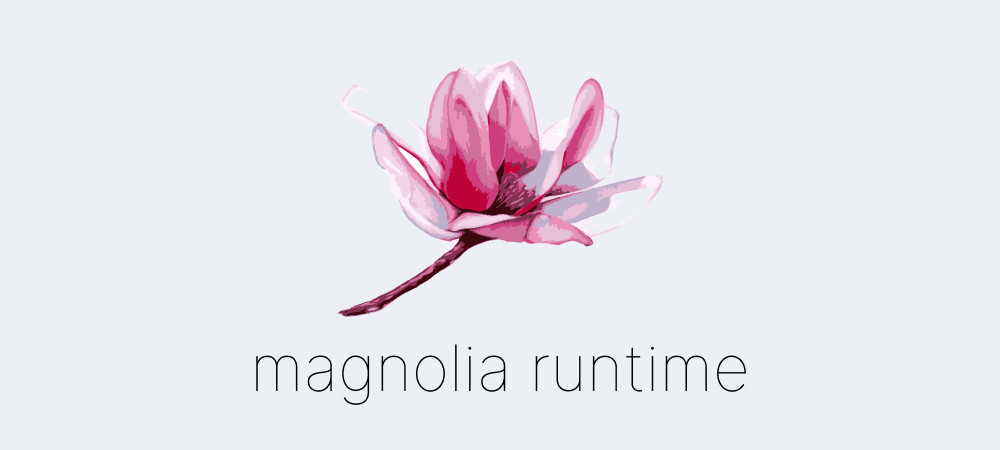

**WARNING: This software is still in its early stages, it is NOT production ready! (Well technically it could be, but you know what I mean.)**

Magnolia runtime is a different-ish paper server fork for following reasons:
* Instead of patching server code directly everything will be gradually moved overt to `magnolia-core` module that does not require patches for changes
* Bukkit, Spigot and Paper APIs will be gradually deprecated and their new replacement will be implemented in `magnolia-api` module that again does not require patches for changing things
* API changes will break things, there will be no support for plugin compatability

You can consider this as a hard fork, patches from paper will still be included but don't count on every single one

For the long term goal:
* Completely get rid of Spigot dependency, reasoning here is I don't want to depend on md_5 and as we are not planning on supporting their plugins this should not be that big of a problem?
* This is a personal long term goal, but maybe you are willing to help; learn how paperweight works in depth, right now I have a high level understanding what and how it works, but I need to know more

### Special thanks

**[Kristjan Krušič](https://github.com/krusic22)** - For obvious reasons.